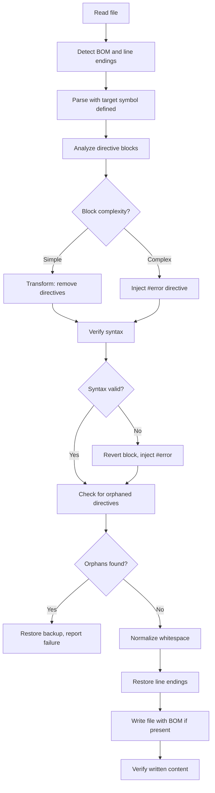

# Conditional Remover

A Roslyn-based CLI tool that removes preprocessor conditionals from C# files. Targets `NET8_0_OR_GREATER` by default; use `--target` for other symbols.

## Quick Start

```bash
# Build
dotnet build src/Net8ConditionalRemover

# Preview changes (recommended first step)
dotnet run --project src/Net8ConditionalRemover -- ./src --dry-run --verbose

# Process with backup
dotnet run --project src/Net8ConditionalRemover -- ./src --backup
```

## CLI Options

| Option | Description |
|--------|-------------|
| `<path>` | File or directory to process (required) |
| `--dry-run` | Preview changes without modifying files |
| `--verbose` | Show detailed output |
| `--backup` | Create `.bak` files before modifying |
| `--parallel` | Process files concurrently |
| `--report <path>` | Write JSON report to specified path |
| `--target <symbol>` | Symbol to remove (default: `NET8_0_OR_GREATER`) |
| `--define <symbol>` | Additional preprocessor symbols (repeatable) |
| `--include-generated` | Process generated files (`*.g.cs`, `*.Designer.cs`) |
| `--fail-on-review` | Exit with code 2 if blocks need manual review |

## Pattern Handling

The tool classifies conditional blocks into five patterns:

### Pattern A: `#if TARGET`...`#else`...`#endif`

Keeps target branch, removes else branch.

**Before:**
```csharp
#if NET8_0_OR_GREATER
using System.Text.Json;
#else
using Newtonsoft.Json;
#endif
```

**After:**
```csharp
using System.Text.Json;
```

### Pattern B: `#if !TARGET`...`#endif`

Removes entire block (negated target is false after migration).

**Before:**
```csharp
public class Service
{
#if !NET8_0_OR_GREATER
    [Obsolete("Use modern API")]
#endif
    public void Process() { }
}
```

**After:**
```csharp
public class Service
{
    public void Process() { }
}
```

### Pattern C: `#if TARGET`...`#endif` (no else)

Removes directives, keeps content.

**Before:**
```csharp
#if NET8_0_OR_GREATER
using System.Collections.Frozen;
#endif
```

**After:**
```csharp
using System.Collections.Frozen;
```

### Pattern D: `#elif` branches

Injects `#error` for manual review.

**Before:**
```csharp
#if NET8_0_OR_GREATER
var x = 1;
#elif NETSTANDARD2_0
var x = 2;
#else
var x = 3;
#endif
```

**After:**
```csharp
#error NET8_REVIEW_REQUIRED: Complex conditional with #elif branches
#if NET8_0_OR_GREATER
var x = 1;
#elif NETSTANDARD2_0
var x = 2;
#else
var x = 3;
#endif
```

### Pattern E: Boolean expressions (`&&`, `||`)

Injects `#error` for manual review.

**Before:**
```csharp
#if NET8_0_OR_GREATER && DEBUG
var debug = true;
#endif
```

**After:**
```csharp
#error NET8_REVIEW_REQUIRED: Boolean expression (&&/||) requires manual simplification
#if NET8_0_OR_GREATER && DEBUG
var debug = true;
#endif
```

## Processing Flow



## Compilation Gate

The tool verifies syntax after each transformation. If a transform introduces syntax errors, it reverts that block and injects `#error` instead:

1. **Transform** - Apply rewriter to remove directives
2. **Verify** - Parse result and check for syntax errors
3. **Fallback** - On error, revert block and inject `#error NET8_REVIEW_REQUIRED`

This prevents broken code. Complex patterns that the tool cannot safely transform receive `#error` directives, which fail the build until resolved.

## Exit Codes

| Code | Meaning |
|------|---------|
| 0 | All files processed, all blocks cleaned |
| 1 | One or more files failed (syntax errors, orphaned directives) |
| 2 | Blocks flagged for review (only with `--fail-on-review`) |

## Examples

### Single file preview

```bash
dotnet run --project src/Net8ConditionalRemover -- src/Services/UserService.cs --dry-run --verbose
```

### Directory with backup and report

```bash
dotnet run --project src/Net8ConditionalRemover -- src/ --backup --report results.json
```

### CI pipeline gate

```bash
dotnet run --project src/Net8ConditionalRemover -- src/ --fail-on-review --report results.json
if [ $? -eq 2 ]; then
    echo "Migration incomplete - manual review required"
    exit 1
fi
```

### Target different symbol

```bash
dotnet run --project src/Net8ConditionalRemover -- src/ --target NET9_0_OR_GREATER
```

### Find flagged locations

```bash
grep -rn 'NET8_REVIEW_REQUIRED' --include='*.cs' src/
```

## Output

```
Found 42 files to process

  OK src/Services/UserService.cs (5 cleaned)
  REVIEW src/Services/AuthService.cs (3 cleaned, 2 need review)
  OK src/Models/User.cs (1 cleaned)

=======================================================
  Files processed:     42
  Blocks cleaned:      87
  Blocks need review:  2 (#error injected)
  Files failed:        0
=======================================================

Warning: 2 complex blocks have #error directives injected.
  Build will fail until these are manually reviewed and resolved.

  To find them: grep -rn 'NET8_REVIEW_REQUIRED' --include='*.cs'
```
